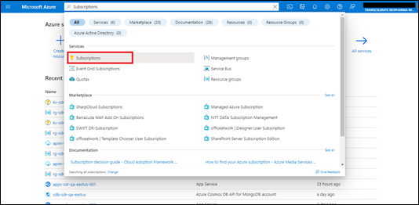

- [Introduction](#introduction)
  - [Definitions and Acronyms](#definitions-and-acronyms)
  - [Document Scope](#document-scope)
  - [Out of Scope](#out-of-scope)
  - [Audience](#audience)
  - [Pre-Requisites](#pre-requisites)
- [Azure Infrastructure](#azure-infrastructure)
  - [Resource Provider Registration](#resource-provider-registration)
  - [Create Azure AD Groups](#create-azure-ad-groups)
  - [Create Users](#create-users)
  - [Role Based Access Controls (RBAC)](#role-based-access-controls-rbac)
  - [Storage Account and Service Principal Configuration in Azure](#storage-account-and-service-principal-configuration-in-azure)
  - [Adding Secrets in GitHub](#adding-secrets-in-github)
  - [Execute GitHub Action for IaC deployment](#execute-github-action-for-iac-deployment)
  - [Manual Configuration Changes on Azure Platform](#manual-configuration-changes-on-azure-platform)
    - [PaaS Setup – OAuth 2.0 Configuration for SDR UI Application](#paas-setup--oauth-20-configuration-for-sdr-ui-application )
    - [UI App Path Mapping](#ui-app-path-mapping)
    - [Key Vault](#key-vault)
- [Resource Validation](#resource-validation)
  - [Low-Level Design Document](#low-level-design-document)
  - [Virtual Network](#virtual-network)
  - [Subnet](#subnet)
  - [Delegated Subnet](#delegated-subnet)
  - [Other Resources](#other-resources)
- [Application Code Deployment](#application-code-deployment)
  - [GitHub Secrets used in WorkFlow](#github-secrets-used-in-workflow)
  - [Deploy the UI Application](#deploy-the-ui-application)
  - [Deploy Back-End API](#deploy-the-ui-application)
  - [Deployment Verification](#deployment-verification)
- [PaaS Setup](#paas-setup)
  - [PaaS Setup for APIM](#paas-setup-for-apim)
 
# Introduction
This document details the steps required to set up a new environment for the Study Definition Repository – Reference Implementation (MVP release) on Microsoft Azure Cloud Platform. It provides details for Infrastructure setup, environment validation, deploying the Web Application for User Interface and Application Programming Interface. 

This document is organized sequentially including Infrastructure, PaaS, UI and API components setup and is presented in a dependency-based order. All the sections listed here are mandatory for the environment setup.
## Definitions and Acronyms
|Term / Abbreviation	|Definition|
|-----|-----|
|AAD|	Azure Active Directory|
|AD|	Active Directory|
|API|	Application Programming Interface|
|Azure CLI	|Azure Command Line Interface|
|DB|	Database|
|DDF|	Digital Data Flow|
|HTTP|	Hypertext Transfer Protocol|
|IaC|	Infrastructure-as-Code|
|JSON|	JavaScript Object Notation|
|LLD|Low Level Design|
|MMC|	Microsoft Management Console|
|MS|	Microsoft|
|PaaS|	Platform-as-a-Service|
|RBAC|	Role Based Access Control|
|REST|	Representational State Transfer|
|SDR|	Study Definition Repository|
|UI|	User Interface|
|URL|	Uniform Resource Locator|
|VNet|	Virtual Network|

## Document Scope
 Scope of the document includes steps on how to create the Azure Active Directory Groups, Service Connections, Service Principals, and how to configure access using RBAC. This document also describes the process of application deployment for both UI and API along with PaaS Setup for hosting and integrating UI application (WebApp), Web API, APIM and CosmosDB. This also captures the Environment validation steps and Application Smoke testing.
## Out of Scope
 This document does not mention any details regarding setting up of a new Subscription as this assumes there is already an active subscription. This document also does not address application architecture patterns or designs.
## Audience
This document assumes a good understanding of Azure concepts and services. The audience for this document includes Azure Administrators, DevOps Engineers, Developers with experience in Angular and .NET development.
## Pre-Requisites
- Access to the low-level design document and basic understanding on how to use it.<br> 
- Access to the [Azure portal](https://portal.azure.com/#home) with required permissions (detailed in upcoming sections).<br> 
- Azure CLI Refer to [Install CLI](https://docs.microsoft.com/en-us/cli/azure/install-azure-cli)<br> 
- An Active Azure Tenant and Subscription. To setup Azure subscription please follow the below Microsoft Documentation<br> 
[Create your initial Azure subscriptions - Cloud Adoption Framework | Microsoft Docs](https://urldefense.proofpoint.com/v2/url?u=https-3A__docs.microsoft.com_en-2Dus_azure_cloud-2Dadoption-2Dframework_ready_azure-2Dbest-2Dpractices_initial-2Dsubscriptions&d=DwMFAg&c=eIGjsITfXP_y-DLLX0uEHXJvU8nOHrUK8IrwNKOtkVU&r=ymlYAgLatobOHqDseh52aLn4thnuuisuycD8yBsPG5-wMw4-VtvvXLUcUwJ4p0kY&m=b4Hw4tRqR53jf9l9cLauC04FAB2DhUu2z71iVWDXao1jCdAxvGkVN-rl_RPyxEIJ&s=RZzDYj4Ra_Gtb9Gou6aWnTwF_Krr1l-dpKP6si39Y1Q&e=)

# Azure Infrastructure
## Resource Provider Registration
#### GOAL:
The Resource Provider Registration configures the Azure subscription to work with the resource provider.
#### PRE-REQUISITES:
Global Admin or Subscription Owner level of access to Azure.
#### STEPS:
i.	Sign into the Azure portal.<br> 
ii.	On the Azure portal menu<br> 
&nbsp;&nbsp;&nbsp;&nbsp;•	Search for Subscriptions.<br> 
&nbsp;&nbsp;&nbsp;&nbsp;•	Select it from the available options as shown below.

<p align="center"> 

iii.	Select the subscription you want to view.

<p align="center"> 

iv.	On the left menu<br>
    Under Settings<br>
    select Resource providers.
    
<p align="center"> 
 
v.	Find the resource provider you want to register and select Register. To maintain least privileges in your subscription, only register the additional resource providers (other than default) that are required as listed below.<br>
The Providers to be registered are:<br>
&nbsp;&nbsp;&nbsp;&nbsp;•	Microsoft.Network<br>
&nbsp;&nbsp;&nbsp;&nbsp;•	Microsoft.OperationalInsights<br>
&nbsp;&nbsp;&nbsp;&nbsp;•	Microsoft.ApiManagement<br>
&nbsp;&nbsp;&nbsp;&nbsp;•	Microsoft.DocumentDB

<p align="center"> 
 
## Create Azure AD Groups
#### GOAL:
Create Azure AD groups to manage Role Based Access Controls (RBAC) on resources for team members.
#### PRE-REQUISITES:
- Global administrator/Owner/User Administrator level of access at Active Directory Level.<br> 
Below are the groups and role assignments created and managed for SDR Reference Implementation.

|RBAC Group Name| 	Azure Built-In Role| 	Scope| 	Usage|
|-----|-----|-----|-----|
|GlobalAdmin_Group|	Global Administrator|	Azure Active Directory|	Can manage all aspects of Azure AD and Microsoft services that use Azure AD identities.| 
|Contributor_Group|	Contributor|	Subscription|	Grants full access to manage all resources but does not allow you to assign roles in Azure RBAC, manage assignments in Azure Blueprints, share image galleries, or perform Azure Policy operations.| 
|Owner_Subscription_Group|	Owner	|Subscription|	Grants full access to manage all resources, including the ability to assign roles in Azure RBAC.|
|Infra_Group|	Contributor|	Subscription|	Grants full access to manage all resources but does not allow you to assign roles in Azure RBAC, manage assignments in Azure Blueprints, share image galleries, or perform Azure Policy operations.|
|Infra_Group|	Global Reader|	Azure Active Directory|	Can be able to read all users and groups information in Azure AD.|
|Infra_Group|	User Administrator|	Azure Active Directory|	Can manage all aspects of users and groups, including resetting passwords for limited admins.|
|Infra_Group|User Access Administrator|	Subscription|	Let's you manage user access to Azure resources. |
|DevelopmentTeam_Group	|Reader|	Subscription|	Grants Reader access for all the resources in the Subscription but does not allow you to manage them.|
|DevelopmentTeam_Group	|	Contributor|	Resource Group	|Grants full access to manage all resources in the Resource Group.|
|TestingTeam_Group|	Reader|	Resource Group|	Grants Reader access for all the resources in the Subscription but does not allow you to manage them.|
|AppRegistration_Group	|Application administrator|	Azure Active Directory|	Can create and manage all aspects of app registrations and enterprise apps.|

**Note:**  To assign Azure AD roles to groups required Azure AD Premium P1 or P2 license, since this solution is part of MVP leveraged Azure AD Free plan. Follow the [Microsoft](https://docs.microsoft.com/en-us/azure/active-directory/roles/groups-assign-role) Doc to assign Azure AD role to groups.

#### STEPS:
i.	Login to Azure portal<br>
ii.	Search for Azure Active Directory<br>
iii.	Click on the Groups on the left panel in AAD.<br>
iv.	Click on New group tab on the top as shown below, add the security group and save the changes by adding the members to the group.

<p align="center"> 
 

<p align="center"> 
 
## Create Users
#### GOAL:
 Create users for provisioning access to the resources on Azure Portal.
#### PRE-REQUISITES: 
- Global administrator/User Administrator level of access at Active Directory Level.
#### STEPS: 
i.	Login to Azure portal<br>
ii.	Search for Azure Active Directory (AAD)<br>
iii.	Click on the users on the left panel in AAD.<br>
iv.	Click on New User tab on the top, add the user and save the changes.

<p align="center"> 
 
## Role Based Access Controls (RBAC)
#### GOAL:
 Providing access and assigning roles to Azure AD groups for them to access the resources.
#### PRE-REQUISITES: 
- Contributor and User Administrator level of access at Subscription and Active Directory Level respectively. 
#### STEPS:
Access Control (IAM) is to limit access and assign roles to groups at the subscription, resource group, and resource level. 
At subscription level<br>
i.	Go to the subscription.<br>
ii.	On the left pane select Access control (IAM) as shown in below screenshot.

<p align="center"> 
 
iii.	Click on + Add and add the role assignment

<p align="center"> 
 
iv.	Select the required role (ex: reader, contributor etc., Refer Table 1) for the members and assign the role to the created groups as shown in the screenshot below and save the changes.

<p align="center"> 
 
<p align="center"> 
 
v.	To view the roles assigned to a particular group navigate to Role assignments tabs as shown below:

<p align="center"> 
 
The same procedure should be followed to provide access/assign roles to any resource in the Azure portal.

## Storage Account and Service Principal Configuration in Azure
#### GOAL:
Setup storage account and service principal in Azure to enable deployment from GitHub.
#### PRE-REQUISITES:
- Contributor level of access at Active Directory Level. 
#### STORING THE TERRAFORM STATE FILE REMOTELY:
When deploying resources with Terraform, a state file must be stored; this file is used by Terraform to map Azure Resources to the configuration that you want to deploy, keeps track of meta data, and can also help with improving performance for larger Azure Resource deployments.<br>
i.	Create Storage Account and Blob Container for storing State file remotely.<br>
ii.	Perform the below commands on Azure CLI for storage Account creation.

```
# Create Resource Group
az group create -n ResourceGroupName -l eastus2

# Create Storage Account
az storage account create -n StorageAccountName -g ResourceGroupName -l eastus2 --sku Standard_LRS

# Create Storage Account Container
az storage container create -n StorageBlobContainerName --account-name StorageAccountName --auth-mode login
```
# AZURE SERVICE PRINCIPAL
Create a service principal that will be used by Terraform to authenticate to Azure and assign role to this newly created service principal (RBAC) to the required subscription.<br>
i.	Perform the below command on Azure CLI and capture the JSON output and create an AZURE_SP secret on GitHub and provide the captured output as value for the secret.<br>
ii.	Provide User Administrator access on Azure AD and User Access administrator access on Azure Subscription.

```
# Create Service Principal 

az ad sp create-for-rbac --name "ServicePrincipal" --role contributor --scopes /subscriptions/[enter subscription id] --sdk-auth

Service Principal Sample JSON output:
{
"clientId": "***Client-Id***",
"clientSecret": "***Client-Secret***",
"subscriptionId": "***SusbscriptionId***",
"tenantId": "***TenantID***",
"activeDirectoryEndpointUrl": "https://login.microsoftonline.com",
"resourceManagerEndpointUrl": "https://management.azure.com/",
"activeDirectoryGraphResourceId": "https://graph.windows.net/",
"sqlManagementEndpointUrl": "https://management.core.windows.net:8443/",
"galleryEndpointUrl": "https://gallery.azure.com/",
"managementEndpointUrl": "https://management.core.windows.net/"
}
```
## Adding Secrets in GitHub
#### GOAL:
Configure secrets in GitHub used by GitHub Actions during deployment workflow execution.
#### PRE-REQUISITES:
- Repo Admin level of access on GitHub Repository<br>
- Capture below secret values based on environment design decisions and storage account, service principal details from Section (Storage Account and Service Principal Configuration in Azure)

|Secret Name|	Values|
|-----|-----|
|AZURE_SP	|The Service Principal details in JSON format.|
|AZURE_RESOURCEGROUP	|The name of the Resource Group that contains the storage account.|
|AZURE_STORAGEACCOUNT|	The Storage Account name|
|AZURE_CONTAINERNAME|	The name of the blob container wherein the Terraform State file will be stored.|
|AZURE_CLIENT_ID	|The Client Id of the service principal.|
|AZURE_CLIENT_SECRET	|The Client Secret value of the service principal.|
|AZURE_SUBSCRIPTION_ID	|The Azure Subscription ID|
|AZURE_TENANT_ID|	The Azure Tenant ID|
|AZURE_RMKEY|	Terraform state file name for each environment. (Eg: xxxxdev.tfstate).|
|Env	|Provide the name of the environment (for example, Dev or QA), which will be added to the resource naming convention.|
|VNet-IP|	Provide the VNet Address Space|
|Subnet-IP|	Provide the Subnet Address Space|
|Subnet-Dsaddress1|	Provide the Delegated Subnet1 Address Space|
|Subnet-Dsaddress2	|Provide the Delegated Subnet2 Address Space|
|subscription|	Provide the short form of the subscription name; this will be added to the resource naming convention.|
|Publisher-Name|	Provide the Publisher name for API Management Resource.|
|Publisher-Email|	Provide the publisher email id for API Management Resource.|
|ADgroup1|	Provide the name of the Azure AD Group for contributor access to the App Resource Group (Admin Group).|
|ADgroup2|	Provide the name of the Azure AD Group for contributor access to the App Resource Group (DevelopmentTeam_Group).|
|ADgroup3|	Provide the name of the Azure AD Group for Reader access on App & Core Resource Groups.|
|Serviceprincipal|Provide the name of the Service principal that was created for the Git connection;it will provide key vault secret user access and access policies for secrets on Key Vault for the Service Principal.|

#### STEPS:
Add GitHub Secrets entries for all the secrets captured in the pre-requisites.<br>
i.	Go to repository settings.<br>
ii.	On the lower left-hand side of the screen, click on Secrets.<br>
iii.	Under that click on Actions.<br>
iv.	Then click on New Repository Secret.

<p align="center"> 
 
v.	After clicking New Repository Secret, fill the details of the secret (name and value) in the boxes
 
<p align="center"> 
 
## Execute GitHub Action for IaC deployment 
#### GOAL:
Execute the GitHub actions to deploy the Azure resources using IaC code.
#### PRE-REQUISITES:
- Repo Admin level of access on GitHub Repository<br>
- For setting up the actions in GitHub, user must have Write permission on repos
#### DEPLOYMENT:
The folder `.github/workflows` in the IaC Repository on GitHub contains the GitHub Actions yaml script (main.yml) for deploying the Terraform IaC code on Microsoft Azure Platform.

#### main.yml:

The yaml file is a multi-job script that will perform security checks on IaC code as well as the deployment of resources to the target environment on Microsoft Azure Platform.

#### STEPS:
i.	Go to GitHub Actions and under the list of workflows click on CI.<br>
ii.	In this workflow click Run Workflow to trigger the Deployment Action.<br>
iii.	Once the workflow completes successfully, the SDR Solution resources should have been deployed to Azure platform.

# Manual Configuration Changes on Azure Platform
## PaaS Setup – OAuth 2.0 Configuration for SDR UI Application
#### GOAL:
Azure AD Client Application Registration and OAuth 2.0 configuration for SDR UI application. 
#### PRE-REQUISITES: 
- Global Administrator level of access at Active Directory level.
#### STEPS TO CREATE SDR UI APP REGISTRATION:
i.	Go To Azure AD → App Registrations→→Select UI App Registration

<p align="center"> 

ii.	Go to Authentication blade, add additional Redirect URL as needed. Add localhost URL's for testing the application from development machine.

<p align="center"> 
 
iii.	Go to "Expose an API" blade and click on "Add a Scope". Provide scope name, select "Admins and users" in "Who can consent", provide admin consent display name and finally click on "Add Scope".

<p align="center"> 
 
iv.	Go to API Permissions → Click on Add a permission →Select My Api’s → Select Backend app registration exposed Api on step 4. → select Api (ui-access) → click Add Permission.

<p align="center"> 
 
<p align="center"> 
 
v.	Grant Admin consent.

<p align="center"> 

vi.	Go to certificates & secrets → click on client secrets → click new client secret and copy the value and add it on Key Vault secrets.

<p align="center"> 
 
vii.	Capture the client id and tenant id and add it on Key Vault secrets. We must generate tokens for authenticating to the SDR UI Application using the client app registration details (client ID, Tenant ID, and Secret value). Refer Section 2.8.3 for Key Vault secrets.

<p align="center"> 
 
The Azure AD App registration for UI has been created successfully.
```
Note: All the users added at AD level will have access to the SDR UI Application by default.
```
## UI App Path Mapping
#### GOAL:
Update the Path Mapping of UI Azure App Service.
#### PRE-REQUISITES: 
- Contributor access at Resource Group level.
#### STEPS:
i.	Navigate to UI App Service instance in App resource group.<br>
ii.	Go to Configuration → Path Mappings<br>
iii.	Change the Physical Path from site\wwwroot to site\wwwroot\SDR-WebApp for accessing the app URL.

<p align="center"> 
 
## Key Vault
#### GOAL:
- Add access policy and enable Azure Key Vault Administrator User to manage secrets.<br>
- To create secrets in Azure Key Vault
#### PRE-REQUISITES: 
- Contributor level of access for Resource Group.<br>
- Capture below secret values from the deployed resources.

|Secret Name	|Secret Value|
|-----|-----|
|Apim-BaseUrl|	Provide API Management URL as key value (E.g., https://apim-sdr-qa-eastus.azure-api.net/studydefinitionrepository/v1/)|
|ApplicationInsights--InstrumentationKey	|Provide Application Insights Instrumentation key |
|AzureAd-Audience|	Provide the Azure App Registration Scope URL, Refer to Section [UI App Path Mapping](#ui-app-path-mapping)  step 3 for scope URL (E.g.: api://0000-0000-000-000/ui-access)|
|AzureAd--Audience	|Provide the UI app registration Application ID URI (E.g.:  api://0000-0000-000-000)|
|AzureAd-ClientSecret	|Provide App Registration Client secret value.|
|AppInsights-ApiKey|	Provide Application Insights Api Key Value|
|AppInsights-AppId	|Provide Application Insights AppId|
|AppInsights-RESTApiUrl|	Provide Default URL https://api.applicationinsights.io/v1/apps |
|AzureAd-Authority|	Provide the Azure Ad authority value (https://login.microsoftonline.com/(Provide Azure AD Tenant ID))|
|AzureAd-ClientId|	Provide the App Registration client ID, refer to Section [UI App Path Mapping](#ui-app-path-mapping) App Registration step 7 for client ID|
|AzureAd-LoginUrl|	Provide the Front End (UI) App Service URL.|
|AzureAd-RedirectUrl|	Provide the Redirect URL (E.g.:https://Front End App service URL (UI)/home)|
|AzureAd-TenantId|	Provide the Azure AD Tenant ID, refer to Section [UI App Path Mapping](#ui-app-path-mapping) App Registration step 7 for Tenant ID|
|ConnectionStrings--DatabaseName	|Provide the Cosmos DB Database Name.|
|ConnectionStrings--ServerName	|Provide the Cosmos DB connection string.|
|Azure-SP	|Store the Azure Service Principal JSON to utilize for API and UI deployments.|
|isAuthEnabled	|true|
|isGroupFilterEnabled|	true|
|StudyHistory--DateRange	|30|

#### STEPS FOR ADDING ACCESS POLICY:
The steps for adding Key Vault Administrator to Key Vault access policies for creating secrets are listed below.<br>
i.	Go to → Key Vault → Select Access Policies → Click on Add Access Policy

<p align="center"> 
 
ii.	Select Secret Management → select Secret Permissions (Get, List, Set)

<p align="center"> 
 
iii.	Select Principal → Add Azure Key Vault Administrator User (select the username) → Click Add

<p align="center"> 
 
#### STEPS FOR ADDING KEY VAULT SECRETS:
Add Key Vault entries for all the secrets captured in the pre-requisites.<br>
i.	Go to → Key Vault → Select Secrets → Click Generate/Import

<p align="center"> 
 
ii.	Provide Secret Name and Value → Select Create

<p align="center"> 
 
# Resource Validation
Validate all resources from Azure Portal to ensure that the resource configurations have been deployed in accordance with the low-level design document (LLD).
## Low-Level Design Document
The [low-level design document](ddf-sdr-azure-platform-setup-and-depolment-guide-v3.0.xlsx) contains all the settings and configurations that have been configured on Terraform IaC code.
 
Naming Convention followed for all the resources is as below -<br> 
- Resource type: vnet, subnet, rg, etc.<br>
- App/Svc: Subscription name<br>
- Environment: dev, preprod etc.<br>
- Region: eastus, westus, etc.

<p align="center"> 

<p align="center"> 

```
Note: For Resource Naming Convention best practices please refer [Azure Resource Naming Conventions](https://docs.microsoft.com/en-us/azure/cloud-adoption-framework/ready/azure-best-practices/resource-naming)
```
## Virtual Network
 Validation of Virtual Network (VNet) configuration
 
<p align="center"> 
 
#### PRE-REQUISITES: 
- Reader access at Resource group level
- SDR Reference Implementation Low Level Design Document (LLD) document 
#### STEPS: 
i.	Login to Azure Portal<br>
ii.	Click on the Resource Groups tab<br>
iii.	Select the Resource group for VNet configuration<br>
iv.	Verify that the Basic details like Subscription, Resource Group, Name and Region is as per the LLD<br>
v.	Verify that the IPv4 Address Space is as per the LLD

<p align="center"> 
 
vi.	Go to Security tab and verify that Bastion Host is set as per the LLD<br>
vii.	Go to DDoS Protection tab and verify that it is set as per the LLD

<p align="center"> 
 
viii.	Go to Firewall tab and verify that it is set as per the LLD<br>
ix.	Go to the Tags tab and verify that the Environment and App Layer should be as per the LLD

<p align="center"> 
 
x.	Go to the Diagnostic Settings Tab and verify that the below settings are as per LLD<br>
  - Diagnostic setting name<br> 
  - Configuration for<br>
    - Logs<br>
    - VM Protection Alerts<br>
    - All Metrics<br>
    - Send to Log Analytics Workspace<br>
    - Archive to a Storage Account<br> 
    - Stream to an Event Hub<br>
    - Send to Partner Solution<br>
  - Subscription Name<br> 
  - Log Analytics Workspace name

<p align="center"> 
 
## Subnet 
Validation of Virtual Subnet configuration.
#### PRE-REQUISITES: 
- Reader level of access at Resource group level<br>
- SDR Reference Implementation Low Level Design Document (LLD) document 
#### STEPS:
i.	Login to Azure Portal<br>
ii.	Click on the Resource Groups tab<br>
iii.	Select the Resource group for VNet configuration<br>
iv.	Verify that the below basic details are as per the LLD<br>
  - Name<br>
  - Subnet address range<br>
  - Add IPv6 address space<br>
  - NAT gateway<br>
  - Network Security Group<br> 
  - Route table<br>
  - Services<br> 
  - Delegate subnet to a service

<p align="center"> 
 
<p align="center"> 
 
## Delegated Subnet
Validation of Delegated Subnet configuration.        	
#### PRE-REQUISITES: 
- Reader level of access at Resource group Level. 
#### STEPS:
i.	Login to Azure Portal<br>
ii.	Click on the Resource Groups tab<br>
iii.	Select the Resource group for VNet configuration<br>
iv.	Verify that the below basic details are as per the LLD<br>
  - Name<br>
  - Subnet address range<br>
  - Add IPv6 address space<br>
  - NAT gateway<br>
  - Network Security Group<br>
  - Route table<br>
  - Services<br> 
  - Delegate subnet to a service

<p align="center"> 
 
<p align="center">  
 
<p align="center"> 
 
<p align="center">  
 

## Other Resources
The similar steps mentioned in previous sections for VNet & Subnet resources verifications should be followed to ensure that all the below resources deployed in the Azure Platform are configured in accordance with the LLD.<br> 
- Resource Groups<br>
- App Services<br>
- App Service Plans<br>
- API Management<br>
- Application Insights<br>
- Cosmos DB<br>
- Log Analytics Workspace<br>
- Key Vault

# Application Code Deployment 
## GitHub Secrets used in WorkFlow
#### PRE-REQUISITES:
- Read access to fetch Key Vault secrets in Azure Portal<br>
- User Should have access policies set to read/retrieve secrets from Azure Key Vault in Azure Portal<br>
- User Should have Repo Admin level of access to add/replace the GitHub secrets in GitHub<br>
#### STEPS:
- Login to azure portal, select resource group section<br>
- Navigate to the deployed KeyVault resource and copy the KeyVault URL from Overview blade<br>
- This will be the KEYVAULT_NAME secret value. It will be the same for both UI and API<br>
- Navigate to the deployed App Service for SDR API and copy the name from Overview blade. This will be the AZURE_WEBAPP_NAME for ddf-sdr-api repo secrets.<br>
- Navigate to the deployed App Service for SDR UI and copy the name from Overview blade. This will be the AZURE_WEBAPP_NAME for ddf-sdr-ui repo secrets.<br>
- The value to be added in AZURE_SP secret is generated during Infra Deployment during App Registration and is available in Key Vault secret with name Azure-SP. Retrieve this value to add to GitHub.<br>
- Login to GitHub and navigate to ddf-sdr-api → Settings → Secrets → Actions and add/replace values for AZURE_SP, AZURE_WEBAPP_NAME and KEYVAULT_NAME by clicking on update.<br>
- Login to GitHub and navigate to ddf-sdr-ui → Settings → Secrets → Actions and add/replace values for AZURE_SP, AZURE_WEBAPP_NAME and KEYVAULT_NAME by clicking on Update.

## Deploy the UI Application
#### PRE-REQUISITES:
- Contributor level of access at Resource Group level. 
#### DEPLOYMENT STEPS:
i.	Go to https://github.com/transceleratebiopharmainc, GitHub URL.

<p align="center"> 
 
ii.	Select the required repository, here ddf-sdr-ui.URL – 
https://github.com/transceleratebiopharmainc/ddf-sdr-ui
       
<p align="center"> 
 
iii.	Click on Actions tab.

<p align="center"> 
 
iv.	Click on the workflow CI under All workflow.

<p align="center"> 
 
v.	Click on Run Workflow on the right-hand side. Then the action will be triggered.

<p align="center"> 
 
vi.	The build logs can be seen on clicking the active/running action.

<p align="center"> 
 
vii.	On completion of the workflow, the UI application will be deployed to Azure App Service.                           

## Deploy Back-End API
#### PRE-REQUISITES:
- Contributor access at Resource group Level. 
#### DEPLOYMENT STEPS: 
i.	Go to https://github.com/transceleratebiopharmainc, GitHub URL.

<p align="center"> 
 
ii.	Select the required repository, here ddf-sdr-api. 
URL -  https://github.com/transceleratebiopharmainc/ddf-sdr-api 
   
<p align="center"> 
 
iii.	Click on Actions tab.
          
<p align="center"> 
 
iv.	 Click on the workflow CI under All workflow.

<p align="center">  

v.	Click on Run Workflow on the right-hand side. Then the action will be triggered.

<p align="center"> 

vi.	The build logs can be viewed on clicking the active/running action.

<p align="center"> 
 
vii.	On completion of the workflow, the back-end API will be deployed to Azure App Service.

## Deployment Verification
#### UI APPLICATION VERIFICATION STEPS:
This is to verify the UI Application deployment was successful.
i.	Go to portal.azure.com. Click on resource group

<p align="center"> 

ii.	Select the required resource group and select the UI App Service instance.

<p align="center"> 

iii.	In search box, search for Advanced tools.

<p align="center"> 

iv.	Click on Go.

<p align="center"> 

v.	Go to Debug console and select CMD/Power Shell

<p align="center"> 

vi.	Go to, Site -> wwwroot -> Check that the latest code files are deployed.
    
<p align="center"> 

#### FOR SDR API BACK-END APP VERIFICATION:
The same steps as mentioned above for SDR UI Application verification can be followed for SDR API deployment verification as well, in the corresponding App Service instance.

# PaaS Setup
## PaaS Setup for APIM
#### GOAL: 
- Secure APIs using client certificate authentication in API Management<br>
- API Management uses client certificates to secure API access (i.e., client to API Management). It will validate certificates presented by the connecting client and compare certificate properties to desired values using policy expressions.
#### PRE-REQUISITES: 
- Contributor access at Resource Group level.
#### CREATE CLIENT CERTIFICATE:
i.	Create self-signed certificate for authentication.<br>
```
 New-SelfSignedCertificate -certstorelocation cert:\CurrentUser\my -dnsname apim-envname-eastus-001.azure-api.net
 ```

ii.	Once the certificate is created it should now be available to access under your local system snap-in where you can view the metadata of the certificate. 

<p align="center"> 
 
iii.	Export the certificate in .pfx format and set password when prompted.

#### UPLOAD THE CLIENT CERTIFICATE TO APIM:
i.	In Azure Portal, Go to the Certificates option under the “Security” section of APIM. Go to “Certificates” option and click on “Add” option  

<p align="center"> 

ii.	Upload the password protected Client certificate (.pfx) format as shown below.

<p align="center"> 
 
iii.	Once the certificate is uploaded it should be visible on the API Management certificates blade as mentioned below.  

<p align="center"> 

iv.	Configure the policy to validate one or more attributes of a client certificate used to access APIs hosted in API Management instance.<br>
v.	Go to APIs -> Select the SDR API -> Select “All Operations” -> Inbound processing -> Select Policies 

<p align="center"> 
 
vi.	Add the policy code below to check the thumbprint of a client certificate against certificates uploaded to API Management
```
<policies>
    <inbound>
     <set-variable name="EmailAddress" value="@{
        string name = "EmptyAuthToken";
        var authHeader = context.Request.Headers.GetValueOrDefault("Authorization", "EmptyAuthToken");
        return authHeader.AsJwt()?.Claims.GetValueOrDefault("email", "EmptyAuthToken");
        }" />
        <set-variable name="UserName" value="@{
        string name = "EmptyAuthToken";
        var authHeader = context.Request.Headers.GetValueOrDefault("Authorization", "EmptyAuthToken");
        return authHeader.AsJwt()?.Claims.GetValueOrDefault("name", "EmptyAuthToken");
        }" />
        <choose>
            <when condition="@((context.Variables["EmailAddress"]) != null)">
                <trace source="My Global APIM Policy" severity="information">
                    <message>@(String.Format("{0} | {1}", context.Api.Name, context.Operation.Name))</message>
                    <metadata name="EmailAddress" value="@((string)context.Variables["EmailAddress"])" />
                    <metadata name="UserName" value="@((string)context.Variables["UserName"])" />
                </trace>
            </when>
            <otherwise>
                <trace source="My Global APIM Policy" severity="information">
                    <message>@(String.Format("{0} | {1}", context.Api.Name, context.Operation.Name))</message>
                    <metadata name="EmailAddress" value="Not Available" />
                    <metadata name="UserName" value="Not Available" />
                </trace>
            </otherwise>
        </choose>
        <base />
        <choose>
            <when condition="@(context.Request.Certificate == null || !context.Deployment.Certificates.Any(c => c.Value.Thumbprint == context.Request.Certificate.Thumbprint)
       || context.Request.Certificate.NotAfter<DateTime.Now)">
                <return-response>
                    <set-status code="403" reason="Invalid client certificate" />
                </return-response>
            </when>
        </choose>
        <cors allow-credentials="true">
            <allowed-origins>
                <origin>Add Backend APP Service URL</origin>
                <origin>http://localhost:4200</origin>
                <origin>https://localhost:4200</origin>
                <origin>Add API Management URL</origin>
                <origin>Add Frontend (UI) URL</origin>
            </allowed-origins>
            <allowed-methods preflight-result-max-age="300">
                <method>GET</method>
                <method>POST</method>
                <method>PATCH</method>
                <method>DELETE</method>
            </allowed-methods>
            <allowed-headers>
                <header>*</header>
            </allowed-headers>
            <expose-headers>
                <header>*</header>
            </expose-headers>
        </cors>
    </inbound>
    <backend>
        <base />
    </backend>
    <outbound>
        <base />
    </outbound>
    <on-error>
        <base />
    </on-error>
</policies>
```

<p align="center"> 
